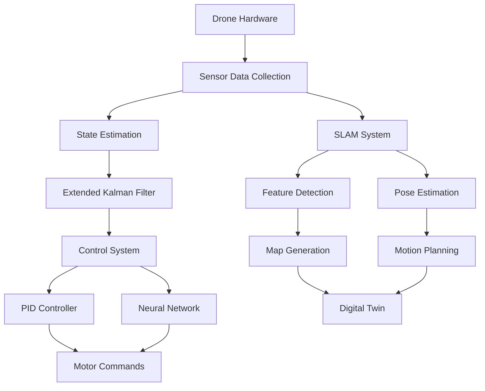

# 🚁 Tello Drone Path Tracker and Digital Twin

## 📋 Overview
An advanced real-time path tracking and digital twin system for the DJI Tello drone, integrating SLAM, computer vision, and hybrid control algorithms for enhanced autonomy and performance.
## 🎯 Project Goals & Significance
This project aims to:

1. **Real-time Control & Autonomy**
   - Develop autonomous navigation capabilities for Tello drones
   - Enable precise path tracking in dynamic environments
   - Achieve real-time response to environmental changes

2. **Digital Twin Innovation**
   - Create a virtual replica of drone behavior
   - Enable predictive analysis and simulation
   - Facilitate safe testing of control algorithms

3. **Advanced Algorithm Integration**
   - Implement state-of-the-art SLAM techniques
   - Combine classical control with machine learning
   - Develop robust safety protocols

4. **Industrial Applications**
   - Indoor navigation and mapping
   - Inspection and surveillance tasks
   - Training and simulation platform

## 🌟 Key Features
- Real-time SLAM-based position tracking
- Neural network-enhanced PID control
- 3D environment mapping and visualization
- Digital twin simulation
- Interactive path planning
- Multi-view visualization
- Safety monitoring and emergency protocols

## 🛠️ Installation
```bash
# Clone the repository
git clone https://github.com/miladnasiri/Djtello-path-Tracker.git
cd Djtello-path-Tracker

# Install dependencies
pip install -r requirements.txt
```

## 🚀 Quick Start
1. Connect to the Tello drone:
```python
from djitellopy import Tello
drone = Tello()
drone.connect()
drone.streamon()
```

2. Run with a real drone:
```bash
python real_drone_demo.py
```

## 🎮 Controls
- T: Takeoff
- L: Land
- Arrow keys: Movement
- Q: Quit

## 🏗️ System Architecture


## 📝 Core Components

### 1. SLAM System (slam_system.py)
#### Feature Detection & Tracking
```python
def detect_features(frame):
    orb = cv2.ORB_create(nfeatures=1000)
    keypoints, descriptors = orb.detectAndCompute(frame, None)
    return keypoints, descriptors
```
#### Pose Estimation
- Feature Matching: BRIEF descriptors, ratio test, RANSAC filtering
- 3D Point Cloud: Triangulation, Bundle Adjustment, ICP refinement

### 2. State Estimation
#### Extended Kalman Filter (EKF)
```python
class DroneEKF:
    def __init__(self):
        self.state_dim = 12  # Position, velocity, attitude, angular velocity
        self.measurement_dim = 6  # Position & orientation
        self.F = np.eye(12)
        self.H = np.zeros((6, 12))
```

### 3. Control System
#### PID Controller
```python
def compute_pid(self, error, dt):
    self.integral += error * dt
    derivative = (error - self.prev_error) / dt
    output = (self.Kp * error + self.Ki * self.integral + self.Kd * derivative)
    return output
```
#### Neural Network Controller
```python
class DroneNN(nn.Module):
    def __init__(self):
        super().__init__()
        self.network = nn.Sequential(
            nn.Linear(12, 64), nn.ReLU(), nn.Linear(64, 32), nn.ReLU(), nn.Linear(32, 3)
        )
```

### 4. Path Planning
- Global: A* algorithm, Bezier curve smoothing
- Local: Velocity obstacles, potential fields, trajectory optimization
```python
def plan_path(start, goal, obstacles):
    path = astar(start, goal, obstacles)
    return bezier_smooth(path)
```

## 📊 Performance Metrics
- SLAM: 30Hz feature detection, ±2cm accuracy
- Control: <5cm error, 100Hz loop rate
- Path Planning: 20Hz update, <50ms optimization time

## 🔒 Safety Systems
### Emergency Protocols
```python
def check_safety(state):
    if state.battery < 15:
        return emergency_landing()
    if detect_collision_risk():
        return avoidance_maneuver()
```
### State Monitoring
- Battery level, signal strength, sensor health
- Emergency landing and collision avoidance

## 📊 Digital Twin Implementation
### State Synchronization
```python
class DigitalTwin:
    def update_state(self, sensor_data):
        self.virtual_state = self.predict_next_state()
        error = self.compute_state_error()
        self.adjust_model(error)
```
### Environment Mapping
- Occupancy grid, point cloud registration, dynamic obstacle tracking

## 📝 Testing & Future Enhancements
### Unit Testing
```python
def test_slam_accuracy():
    known_points = generate_test_points()
    estimated_points = slam.process_points(known_points)
    assert calculate_error(known_points, estimated_points) < ACCURACY_THRESHOLD
```
### Future Enhancements
- Multi-drone coordination
- Real-time path replanning
- GPU acceleration for SLAM

## 💪 Contributing
Contributions are welcome! Check our contributing guidelines.

## 💎 License
MIT License - see LICENSE file for details.

